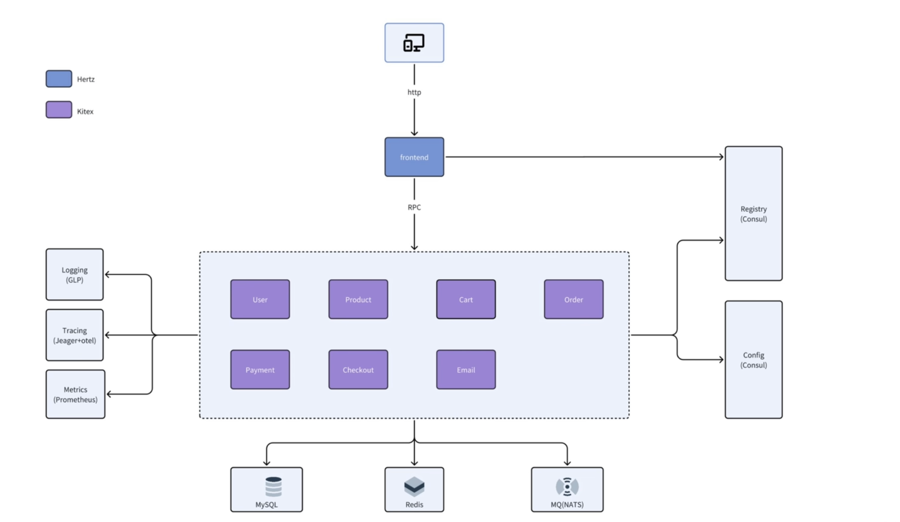
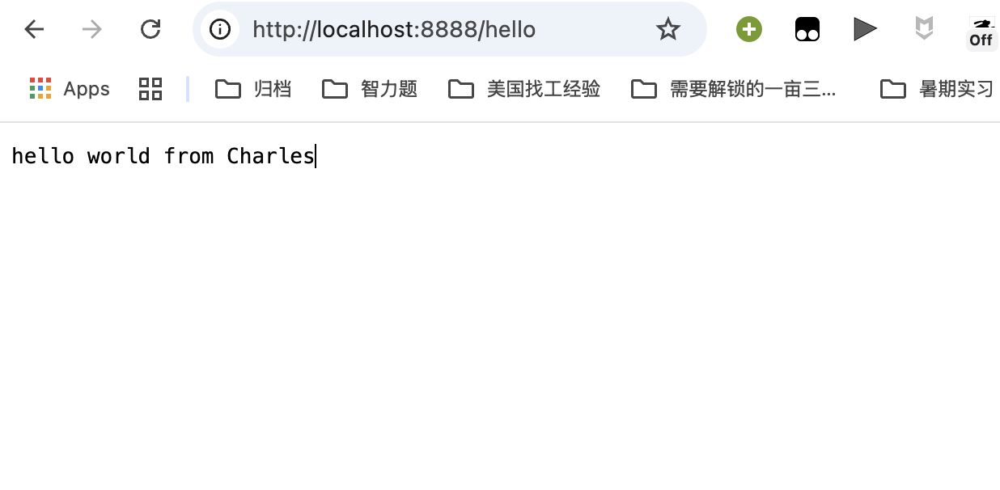
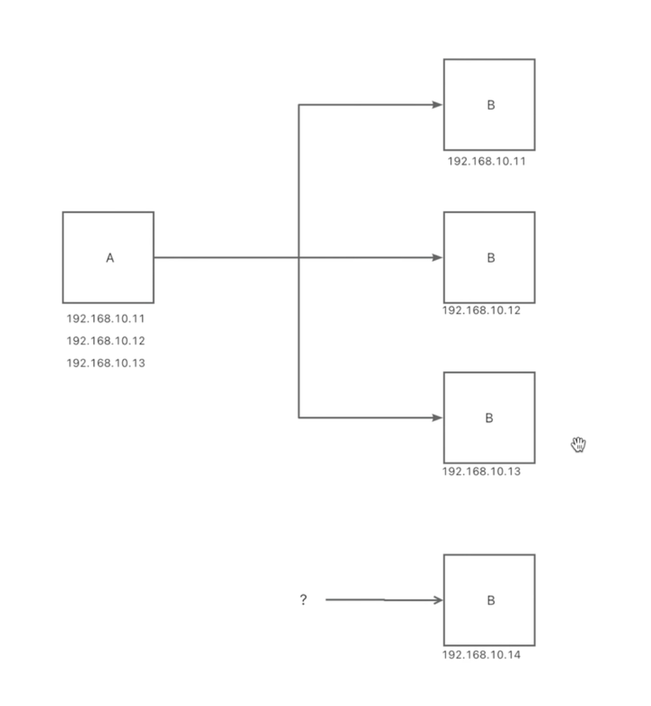
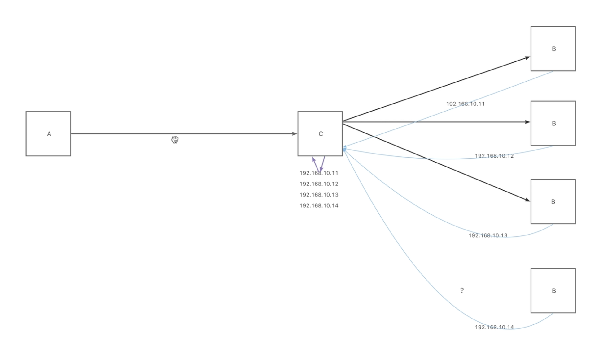
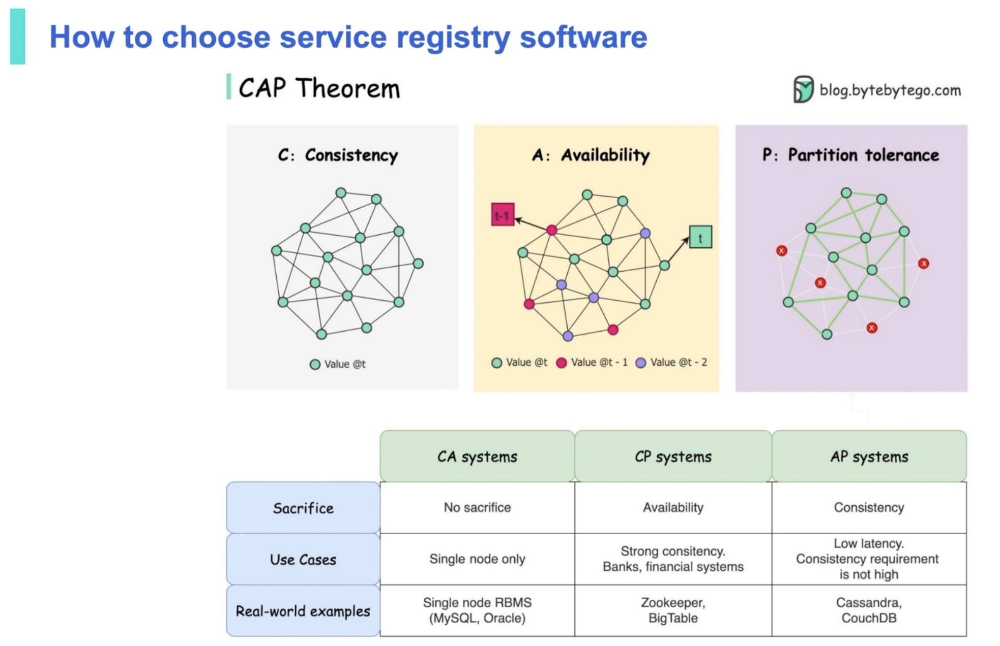

# TikTok E-Commerce：Gomall


### 00项目总体介绍

Kitex：go的rpc框架

Hertz：go的http框架

volo：rust rpc框架


#### **技术栈**：

#### **框架与库**
- **Kitex**：字节跳动开源的高性能 RPC 框架，适用于微服务通信。
- **Hertz**：用于构建高性能 Web 服务的 HTTP 框架。
- **cwgo**：Go 的代码生成工具，通常用于生成服务模板或接口实现。
- **GORM**：Go 的 ORM（对象关系映射）库，简化数据库操作。

#### **数据库与缓存**
- **MySQL**：关系型数据库，用于持久化存储结构化数据。
- **Redis**：高性能内存数据库，常用于缓存、分布式锁等场景。

#### **消息系统与服务发现**
- **NATS**：轻量级消息中间件，支持高效的消息发布/订阅。
- **Consul**：服务发现和配置中心，支持微服务架构的服务注册与健康检查。

#### **监控与追踪**
- **Prometheus**：指标监控系统，支持服务性能监控与告警。
- **OpenTelemetry**：用于分布式链路追踪和度量采集，分析系统瓶颈。

#### **容器与编排**
- **Docker**：容器化技术，使应用能够在任意环境一致运行。
- **K8s（Kubernetes）**：容器编排平台，用于自动部署、扩展和管理容器应用。

#### **项目结构**




### 01开发环境
hertz是http框架，适用于和用户交互的，所以先生成一个hello world

vscode插件

| 插件名               | 功能说明 |
|----------------------|----------|
| **Go**               | 提供 Go 语言的语法高亮、自动补全、调试支持。|
| **Golang Tools**     | 依赖 Go 插件，包含 lint、format、test 等开发辅助工具集。|
| **Docker**           | 支持容器开发，提供 Dockerfile、docker-compose 支持与容器管理功能。|
| **MySQL**            | 用于连接和管理 MySQL 数据库（例如 SQLTools 或类似插件）。|
| **Material Icon Theme** | 更美观的文件图标主题，提升文件识别效率。|
| **YAML**             | 支持 YAML 文件语法高亮、校验、自动补全等功能，常用于配置文件。|
| **vscode-proto3**    | 提供 `.proto` 文件（Protocol Buffers v3）语法支持，包括高亮和代码提示。|
| **Makefile Tools**   | 支持 `Makefile` 的语法高亮、构建任务与调试操作。|
| Thrift | 支持thrift语法高亮 |


终端插件
oh my zsh

plugins
- zsh-syntax-highlighting
- zsh-autosuggestions


`go mod init` 是 Go 语言模块系统的初始化命令，用于创建一个新的 Go 模块。这个命令会在当前目录下生成一个 `go.mod` 文件，该文件定义了模块的导入路径和依赖关系。

使用自己的仓库名称作为模块路径:

```bash
cd hello_world 注意必须在同一目录下才能go mod init
go mod init github.com/charleschile/TikTok-E-Commerce-Gomall/tutorial/hello_world
```

模块路径决定了其他项目如何导入你的代码。选择合适的模块路径取决于:
- 代码托管位置

使用 `go mod init` 后，你可以通过 `go get` 添加依赖，系统会自动更新 `go.mod` 文件。

```bash
go get -u github.com/cloudwego/hertz
```


go get -u github.com/cloudwego/hertz 这个命令的作用是下载并安装 Hertz 框架的最新版本。

- go get 是 Go 语言用于下载和安装依赖包的命令

- -u 参数表示更新（update）已存在的包到最新版本

- github.com/cloudwego/hertz 是要下载的包的路径，即字节跳动开源的高性能 Go HTTP 框架

执行这个命令后：

1. Go 会下载 Hertz 框架及其依赖

1. 更新你项目的 go.mod 和 go.sum 文件，添加 Hertz 作为依赖


https://www.cloudwego.io/zh/docs/hertz/getting-started/

```go
package main

import (
    "context"

    "github.com/cloudwego/hertz/pkg/app"
    "github.com/cloudwego/hertz/pkg/app/server"
    "github.com/cloudwego/hertz/pkg/common/utils"
    "github.com/cloudwego/hertz/pkg/protocol/consts"
)

func main() {
    h := server.Default()

    h.GET("/ping", func(ctx context.Context, c *app.RequestContext) {
            c.JSON(consts.StatusOK, utils.H{"message": "pong"})
    })

    h.Spin()
}

```


go mod tidy 命令的作用是整理和清理项目的依赖关系。具体功能包括：

添加缺失的依赖：检查代码中所有 import 语句，将使用但未在 go.mod 中声明的依赖添加进来

移除未使用的依赖：清理 go.mod 中已声明但代码中没有实际使用的依赖

更新 go.sum 文件：重新计算并确保依赖的校验和正确，保证依赖的完整性和安全性

解决依赖冲突：尝试解决项目中可能存在的依赖版本冲突问题


- context 是 Go 标准库中的一个包，用于在 API 边界和进程之间传递截止日期、取消信号和其他请求范围的值

- 在 Web 服务中，context 通常用于：

请求超时控制

取消长时间运行的操作

在请求处理流程中传递请求相关的数据





### 03脚手架scaffold
IDL: interface definition language

#### 如何解决增加接口和通信函数问题

字段编号系统：Proto使用数字标签（field numbers）而非字段名称进行序列化，这使得：
可以随时添加新字段（只要给定新的字段编号）
旧客户端遇到未知字段时可以安全跳过
可以重命名字段而不影响序列化格式
字段可以标记为optional，使不存在的字段不占用空间

向前/向后兼容性：
添加新字段时，旧客户端会忽略这些字段
删除字段时，只要不重用字段编号，新客户端仍能读取旧数据

Thrift的方案：
与Protocol Buffers类似，使用字段标签系统
提供更丰富的数据类型（包括专门的列表类型）
支持多种序列化格式（二进制协议、紧凑协议等）


**cwgo是一个根绝IDL比如proto和thrift生成代码的工具，是cloudwego框架的一部分**

使用需要下载cwgo: `GOPROXY=https://goproxy.cn/,direct go install github.com/cloudwego/cwgo@latest`

https://github.com/cloudwego/cwgo

https://github.com/cloudwego/thriftgo


cwgo支持zsh终端自动补全功能： https://www.cloudwego.io/docs/cwgo/tutorials/auto-completion/

```bash
cwgo server --type RPC --idl echo.thrift --module github.com/charleschile/TikTok-E-Commerce-Gomall/tutorial/demo_thrift --service demo_thrift

go mod tidy
```


biz是一些业务相关的代码，业务逻辑在service下面

conf是配置文件

Kitex_gen是idl生成的代码


go work use . 命令的作用是将当前目录添加到 Go 工作区（workspace）中。

具体解释：

1. Go 工作区（workspace）：Go 1.18 引入的功能，通过 go.work 文件管理多模块开发环境

1. go work use . 的作用：

- 将当前目录（.）添加到工作区中

- 如果当前目录下有 go.mod 文件，这个模块将被包含在工作区内

- 如果 go.work 文件不存在，会自动创建

1. 工作区的好处：

- 允许同时处理多个相关模块

- 无需修改每个模块的 go.mod 来相互引用

- 便于本地开发多个相互依赖的模块

1. 使用场景：

- 当你有多个相关的 Go 模块需要同时开发

- 当你需要在本地修改某个依赖库并立即测试主项目

例如，如果你有一个主项目和几个本地库模块，使用工作区可以让你在不发布这些库的情况下，让主项目直接使用本地版本的库代码。


运行：

```bash
go mod tidy
go work use. # 注意如果没有go.work的话需要go work init
go run .
```


Protobuf protoc: https://github.com/protocolbuffers/protobuf/releases

或者直接使用brew: `brew install protobuf`

`protoc --version`


如果依赖有不兼容的，去go.mod中找到它，然后在终端go get 这个就行了


```bash
cwgo server -I ../../idl --type RPC --module github.com/charleschile/TikTok-E-Commerce-Gomall/tutorial/demo_proto --service demo_proto --idl ../../idl/echo.proto 
```


Makefile可以减少命令的重复输入


#### .PHONY

`.PHONY` 在 Makefile 中用于声明"伪目标"（phony targets），具体含义如下：

## `.PHONY` 的作用

1. **防止与文件名冲突**：
   - 告诉 `make` 命令，即使当前目录下存在同名文件，也应将该目标视为命令而非文件
   - 确保目标总是被执行，不论同名文件是否存在或是否更新

2. **提高执行效率**：
   - 避免 make 检查文件时间戳来判断是否需要重新构建
   - 跳过文件依赖关系检查，直接执行命令

## 使用场景示例

如果没有声明 `.PHONY`，可能发生以下问题：

```makefile
clean:
	rm -f *.o
```

如果目录中恰好存在名为 `clean` 的文件，执行 `make clean` 时：
- make 会检查 `clean` 文件是否需要更新
- 发现没有依赖，认为 `clean` 已是最新，不执行任何操作

使用 `.PHONY` 后：

```makefile
.PHONY: clean
clean:
	rm -f *.o
```

这样无论是否存在 `clean` 文件，`make clean` 都会执行清理操作。

## 常见的伪目标

通常这些目标需要声明为 `.PHONY`：
- `all`、`build`、`clean`、`install`
- `test`、`lint`、`fmt`
- `run`、`deploy`
- 其他不产生同名文件的命令性目标

这是 Makefile 的最佳实践，可以避免潜在的问题并使意图更加明确。


#### makefile

## Makefile 分析

这个 Makefile 主要用于自动化生成基于不同 IDL（接口定义语言）的 RPC 服务代码。

### 整体作用

这个 Makefile 定义了两个目标：
1. `gen-demo-proto`：生成基于 Protocol Buffers 的 RPC 服务代码
2. `gen-demo-thrift`：生成基于 Thrift 的 RPC 服务代码

通过执行 `make gen-demo-proto` 或 `make gen-demo-thrift` 可以快速生成对应的代码，避免手动输入复杂的命令。

### 特殊符号解释

1. `@` 符号：
   - 位于命令行开头
   - 作用：**抑制命令回显**——执行时不会在终端打印该命令本身
   - 如果没有 `@`，make 会先打印命令再执行它

2. `&&` 符号：
   - Shell 中的**命令连接符**
   - 作用：表示逻辑与关系，只有当前一个命令成功执行（返回值为0）后，才会执行后面的命令
   - 在这里，它的含义是：先切换到指定目录，然后在该目录下执行 cwgo 命令

例如，这行：
```makefile
@cd tutorial/demo_proto && cwgo server -I ../../idl --type RPC ...
```
表示：先静默切换到 `tutorial/demo_proto` 目录，如果成功则执行后面的 `cwgo` 命令。

### 改进建议

这个 Makefile 结构清晰，但可以考虑添加：
1. 默认目标（如 `all`）来同时生成两种代码
2. `clean` 目标来清理生成的代码
3. 使用变量定义重复的部分，提高可维护性

整体来说，这是一个功能明确、结构简洁的 Makefile，很好地服务于 CloudWeGo 框架下的代码生成需求。


### 03服务注册和服务发现

#### 为什么需要服务注册和服务发现 service registry and service discovery

微服务拆分后，为了提高一组应用的整体性能和处理能力，通常部署在多台服务器上

这种分布式部署，比如




A会调用B的接口，首先要知道B在哪台服务器上

B服务会新增机器，改代码和配置文件都需要人工介入


#### 如何实现

可以将C写入A的代码或者配置中，B服务的变更只需要告知C，C作为统一入口调用B

C在内部维护了实例列表

增加了维护了成本，IP资源有限，C形成了新的单点违背了微服务的初衷 




LB：load balance 负载均衡


#### 如何选择注册中心


分布式CAP：工程实现中只能满足其二

C：consistency 一致性

A：availablility 可用性

P：partition tolerence 分区容错性



**CAP定理指出：一个分布式系统不可能同时满足以下三个特性中的两个以上：**

- **一致性（Consistency）**：一致性指的是，不管客户端连接到哪个节点，所有客户端在同一时间看到的数据都是一致的。
- **可用性（Availability）**：可用性指的是，只要客户端发起请求，即使某些节点宕机了，也能得到响应。
- **分区容忍性（Partition Tolerance）**：分区是指两个节点之间通信中断。分区容忍性意味着即使网络发生分区，系统仍能继续运行。


要点：

1. 以demo proto作为服务端改造一些服务注册的代码

2. 然后用docker启动一个consul注册中心
3. 最后编写一个客户端代码，代码要发现proto服务实例，并且进行接口调用

```http
https://www.cloudwego.io/docs/hertz/tutorials/third-party/service_discovery/consul/
```

```bash
go get github.com/hertz-contrib/registry/consul
```

引入consul组件

注意`main.go`里面放的是服务启动的代码


编写docker compose去docker hub搜索查看对应的版本即可: https://hub.docker.com/search


注意现在的consul被迁移到hertz下了，原先在kitex下，这是两个完全不同的包，里面使用的参数也不一样

consul客户端成功启动：


然后编写客户端
